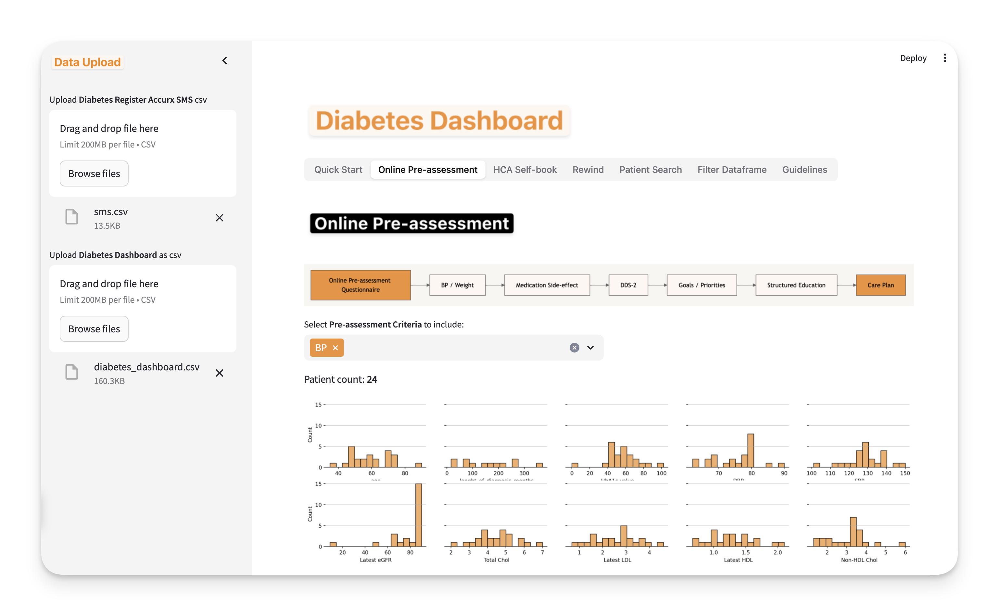

# Diabetes Dashboard for Primary Care

A streamlined **Diabetes Dashboard** for managing diabetes recalls in primary care settings, designed to optimize patient follow-up and streamline assessment, testing, and recall workflows. This tool helps healthcare providers identify, segment, and manage cohorts of diabetic patients for recalls, including online pre-assessments, blood tests, foot checks, and clinician reviews.

The dashboard integrates with Tally forms and Accurx SMS invites, allowing users to quickly prepare and send cohort-specific SMS invitations. The app is accessible directly online at [diabetesdashboard.streamlit.app](https://diabetesdashboard.streamlit.app/).

---

## Features

- **Guideline-Based Recalls**: Provides guidelines-based recall frequencies for key diabetic metrics including HbA1c, blood pressure, lipid profile, renal function, and more.
- **Patient Cohort Segmentation**: Enables filtering of patient cohorts based on clinical need, recent results, and due statuses for recalls.
- **Streamlined Data Processing**: Supports uploading of the latest Diabetes Register and Dashboard files for easy integration and updates.
- **Tally Form Integration**: Guides cohort selection and prepares patients for online pre-assessment, with integration options for Tally forms and Google Sheets.
- **Cohort-Specific SMS Generation**: Downloads custom CSV files compatible with the Accurx SMS tool for efficient patient communication.
- **Visualization**: Displays histograms and other visual summaries of key metrics to help clinicians quickly interpret patient distribution data for key metrics.

---

## Guidelines for Diabetes Management

The tool supports diabetes management according to NICE (National Institute for Health and Care Excellence) guidelines, with recommendations and recall frequencies for various diabetic metrics:

1. **HbA1c (Glycated Hemoglobin)**:
   - If **< 53 mmol/mol**: Annual check.
   - If **53–75 mmol/mol**: Every 3-6 months.
   - If **> 75 mmol/mol**: Every 3 months.

2. **Blood Pressure**:
   - **< 140/80 mmHg** or **< 130/80 mmHg** (for those with renal, ocular, or cerebrovascular disease).
   - Check annually if stable or every 1–3 months if above target.

3. **Lipid Profile (Cholesterol)**:
   - Annual check if stable and on statins.
   - Re-check at 3 months when initiating or changing therapy.

4. **Renal Function (eGFR and ACR)**:
   - Annual check if normal, every 6 months if reduced renal function or albuminuria.

5. **Eye Screening**:
   - Annual check if no signs of retinopathy; every 6 months if high risk.

6. **Foot Examination**:
   - Annual check if low risk; more frequent checks if moderate or high risk.

7. **Body Mass Index (BMI) and Weight**:
   - Annual check if stable or every 6 months if BMI > 30 or weight loss is a goal.

---

## Quick Start Guide

### **Diabetes Recall Workflow**
The tool is optimized to assist with the following steps in the diabetes recall process:

1. **Online Pre-Assessment**:
   - Use Tally forms for the online pre-assessment questionnaire with advanced logic to enhance completion speed. Note: NHS network blocks Tally; set up at home or via a mobile internet connection.
   - Integrate Tally forms with Google Sheets or Notion for easy management of patient responses.

2. **Recall Tool Usage**:
   - Prepare your **Diabetes Register SMS CSV** for Accurx invites. Required columns include `NHS number, Preferred Telephone number, Date of birth, First name, Email`.
   - Save your latest **Diabetes Dashboard** as a CSV file.
   - Upload both files to the tool.
   - Navigate through the interface to segment and optimize patient cohorts for recall.
   - Download targeted SMS CSV files for each patient cohort as needed.

3. **Cohort-Specific SMS Generation**:
   - Customize and generate downloadable CSV files with patient lists specific to each recall activity.
   - Send SMS notifications through the Accurx SMS Tool using the generated files.

### **Visualization of Patient Metrics**
- Access a 2x5 grid of histograms displaying age, diagnosis duration, HbA1c, blood pressure, lipid profiles, and more.
- Quickly interpret data distributions to inform recall priorities and interventions.

### **Links and Resources**
- [Tally Form Template](https://tally.so/templates/diabetes-pre-assessment-questionnaire/mYQ4zm): Preview and download a pre-configured Tally form template for online patient assessments.
- [GitHub Repository](https://github.com/janduplessis883/diabetes-streamlit): Star the project and connect with the developer for support or improvements.

For questions or assistance with using the tool or setting up Tally integrations, please open a GitHub issue.

---

**Thank you for using the **Diabetes Dashboard** to enhance patient care and streamline diabetes management in primary care.**   

If you like this project please STAR it on GitHub
